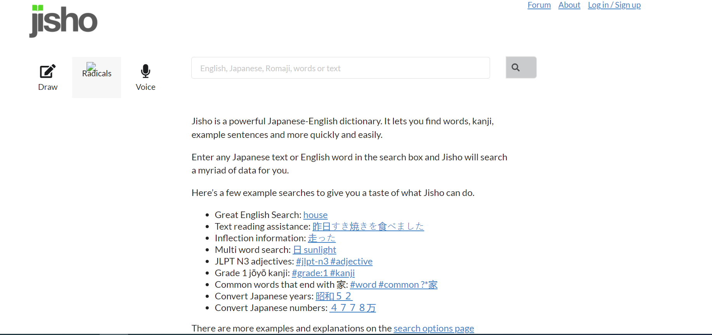
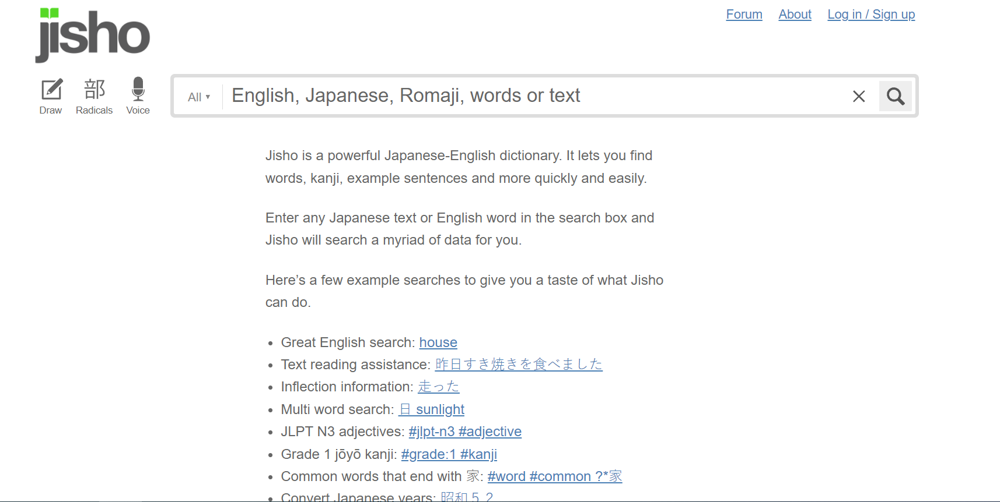

## Introduction

UI Frameworks are a collection of modules that can be used to create user interfaces that can be seen on the web. They are used mainly by web developers to create modernized web pages and applications. Semantic UI is an example of such a UI Framework, and will be used in this discussion of the power of UI Frameworks in a developer's hands, and how they can effectively be tools that handle web development in a much more manageable way. 

## The Power of UI Frameworks

After a couple of weeks with HTML and CSS for webpage creation, and a single week learning the basics of Semantic UI, I believe that using almost any UI framework has the potential to greatly reduce the amount of effort it takes to create a beautiful web page. While there may be a learning curve when it comes to using the framework modules to create your vision, it generally becomes easier with practice, and much less of a headache than creating the elements yourself with pure HTML and CSS. Most of the time, the module you would need to create a section of your web page already exists! You would just need to import it and it would just appear on your web page with all the features you need as if it was magic. 

## A Simple Comparison

Here is an example of a webpage I recreated using Semantic UI in about an hour: 

Compare this to the same website, made with something different:

You can see that results may be slightly different, but the overall result looks similar to an extent and creating the webpage with Semantic UI took considerably less effort than if I were to attempt the recreation with regular HTML elements with normal CSS styling. With my current level of experience, it might take days for my webpage to have any resemblance to the original. 

## Why Learn over normal HTML/CSS?

UI Frameworks may be a hassle to use at first, but learning the intricacies of such a tool will allow you to easily handle template elements on a page and modify them to your liking. While HTML and CSS are already the basic tools that you need to get front-end development done, UI Frameworks accelerate the creation process and organizes the toolkit that is HTML and CSS into manageable tools that you can hold your hand. 
